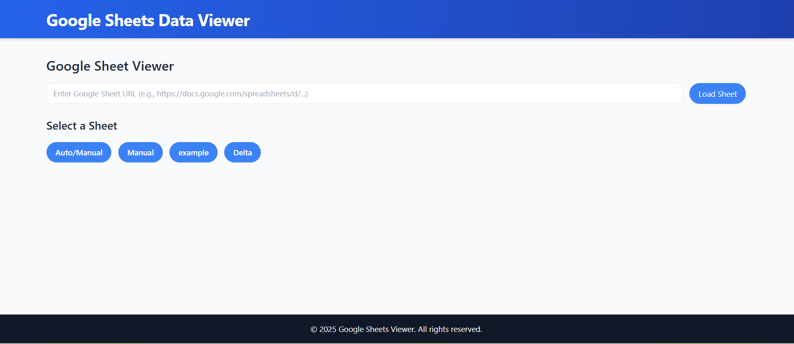
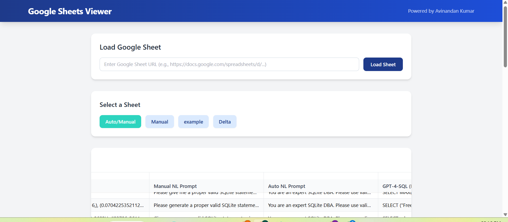

# 📊 Google Sheets Flask Viewer

A modern Flask-based web app to view and interact with **Google Sheets** data in real-time, featuring:

* 🧠 Clean Tailwind CSS UI
* 🔒 Secure OAuth2 + Google Sheets API
* 📁 Dynamic table rendering
* 🧪 Toasts, modals, loading spinners



## 🚀 Features

* Load data from a Google Sheets URL
* View multiple sheets with tabbed navigation
* Interactive UI using Tailwind CSS
* Toast notifications and smooth UX

## 🛠️ Tech Stack

* Python 3.8+
* Flask 3.x
* Google Sheets API
* Tailwind CSS (CDN)
* Jinja2 templating

## 🔐 Setup

1. Clone the repo:

   ```bash
   git clone https://github.com/kavinandan18/google-sheets-flask-viewer.git
   cd google-sheets-flask-viewer
   ```

2. Create virtual environment:

   ```bash
   python -m venv sheetenv
   sheetenv\Scripts\activate
   ```

3. Install dependencies:

   ```bash
   pip install -r requirements.txt
   ```

4. Add your `credentials.json` for Google Sheets access.

5. Run the app:

   ```bash
   python run.py
   ```

## 🧾 License

MIT License
